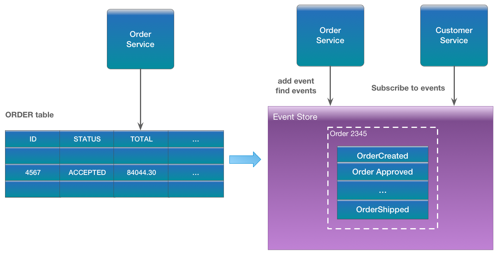
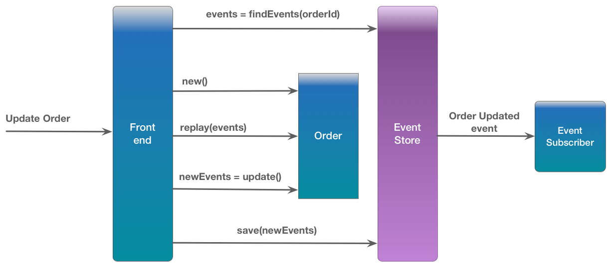
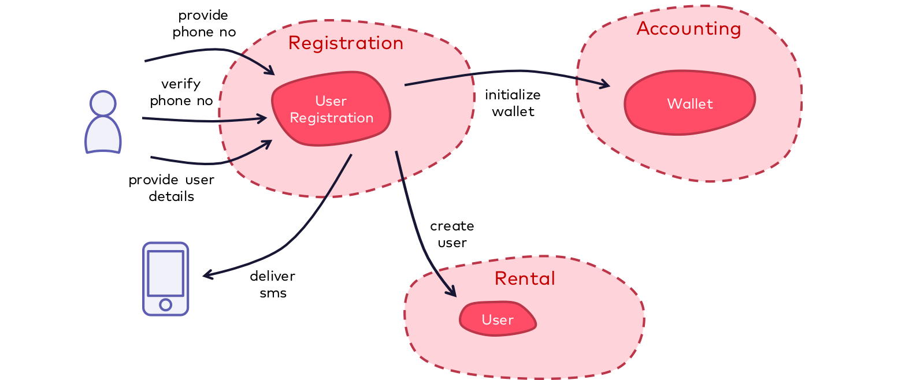

# ES

Event sourcing is a great way to atomically update state and publish events. The traditional way to persist an entity is to save its current state. Event sourcing uses a radically different, event-centric approach to persistence. A business object is persisted by storing a sequence of state changing events. Whenever an object’s state changes, a new event is appended to the sequence of events. Since that is one operation it is inherently atomic. A entity’s current state is reconstructed by replaying its events.

To see how event sourcing works, consider the Order entity. Traditionally, each order maps to a row in an ORDER table along with rows in another table like the ORDER_LINE_ITEM table. But when using event sourcing, the Order Service stores an Order by persisting its state changing events: Created, Approved, Shipped, Cancelled. Each event would contain sufficient data to reconstruct the Order’s state.

Events are persisted in an event store. Not only does the event store act as a database of events, it also behaves like a message broker. It provides an API that enables services to subscribe to events. Each event that is persisted in the event store is delivered by the event store to all interested subscribers. The event store is the backbone of an event-driven microservices architecture.

In this architecture, requests to update an entity (either an external HTTP request or an event published by another service) are handled by retrieving the entity’s events from the event store, reconstructing the current state of the entity, updating the entity, and saving the new events.

Here is how the Order Service handles a request to update an Order

## Other benefits of event sourcing

As you can see, event sourcing addresses a challenge of implementing an event-driven architecture. Additional significant benefits of persisting business events include the following:

- 100% accurate audit logging - Auditing functionality is often added as an afterthought, resulting in an inherent risk of incompleteness. With event sourcing, each state change corresponds to one or more events, providing 100% accurate audit logging.
- Easy temporal queries - Because event sourcing maintains the complete history of each business object, implementing temporal queries and reconstructing the historical state of an entity is straightforward.

__Is Event Sourcing just a persistence strategy?__

You might wonder why we came from __Domain Events__ straight to persistence strategy as these concepts obviously work at different layers / abstraction levels.

... and that's the point: Event Sourcing is a local decision made by a single Bounded Context! The events should not be exposed to the outside world! Other Bounded Contexts do not know about each other's persistence strategy and therefore they don't know and don't care, if another Bounded Context uses Event Sourcing.

If you use Event Sourcing at global scale, you expose your persistence layer. Your persistence becomes your public API. Every time a Bounded Context adjusts its persistent data, we have to deal with a public API change. I'm pretty sure everyone agrees that it's a bad idea that different Bounded Contexts share data in a (relational) database because of development und runtime coupling. But where is the difference? There is none. It doesn't matter if we share events or database tables. In both cases we share our persistence details.

## Domain Driven Design

Domain-Driven Design is an approach to software development that centers the development on programming a domain model that has a rich understanding of the processes and rules of a domain. The name comes from a 2003 book by Eric Evans that describes the approach through a catalog of patterns. Since then a community of practitioners have further developed the ideas, spawning various other books and training courses. The approach is particularly suited to complex domains, where a lot of often-messy logic needs to be organized.

The idea that software systems need to be based on a well-developed model of a domain has been around for at least as long as I've been in the industry. I learned much of this thinking from Jim Odell, who developed this style of thinking with data modeling, information engineering, and object-oriented analysis. Representing the underlying domain was a key part of much work in the database and object-oriented communities throughout the 1980s and 1990s.

Eric Evans's great contribution to this, through his book, was developing a vocabulary to talk about this approach, identifying key conceptual elements that went beyond the various modeling notations that dominated the discussion at the time. At the heart of this was the idea that to develop software for a complex domain, we need to build __Ubiquitous Language__ that embeds domain terminology into the software systems that we build. While many folks talked about developing such models, they were often only done on paper, and usually expected to be done up-front. __DDD__ stresses doing them in software, and evolving them during the life of the software product. Eric is a strong proponent of __Extreme Programming__ and sees __Domain-Driven Design__ as a natural component of an extreme programming approach - a view shared by most XP practitioners I know.

The book introduced the notion of classifying objects into Entities, Value Objects, and Service Objects - what I call the Evans Classification and identifying the concept of Aggregates. I found these filled an important gap in thinking about objects which eluded both programming languages and diagrammatic notations. A particularly important part of DDD is the notion of Strategic Design - how to organize large domains into a network of Bounded Contexts. Until that point, I'd not seen anyone tackle this issue in any compelling way.

Although Eric's background is rooted in the Object-Oriented community, the core notions of Domain-Driven Design are conceptual, and thus apply well with any programming approach - a fact that's especially true of the strategic design aspects.

### Domain Events

In domain-driven design, domain events are described as something that happens in the domain and is important to domain experts. Such events typically occur regardless of whether or to what extent the domain is implemented in a software system. They are also independent of technologies. Accordingly, domain events have a high-value semantics, which is expressed in the language spoken by domain experts. Examples can be:

- A user has registered
- An order has been received
- The payment deadline has expired

Domain events are relevant both within a bounded context and across bounded contexts for implementing processes within the domain. Domain events are also ideally suited to inform other bounded contexts about specific business-related events that have occurred in the own bounded context and thus to integrate several bounded contexts in an event-driven way.

## Events from Event Sourcing ≠ Domain Events

So why do I think that these two concepts do not really fit together so naturally?

Let’s consider the following example: in a domain for bike sharing, a user wants to register in order to rent a bike. Of course one also has to pay for it, which is done through a pre-paid approach using a wallet.

The relevant section of the context map for this domain might look like this:

The registration process works as follows:

- The user enters his/her mobile number through the mobile app.
- The user receives an SMS code to confirm the phone number.
- The user enters the confirmation code.
- The user enters the additional details such as full name or address and completes the registration.

This process is implemented in the `UserRegistration` aggregate in the bounded context `Registration`. The user interacts with “his/her” instance of the `UserRegistration` aggregate several times over the course of the registration process. The state of the `UserRegistration` is built up step by step until the registration is completed successfully. Once done, the user should be able to charge the wallet and rent a bike.

Now, if event sourcing is used to manage the state of the `UserRegistration` aggregate, the following events (containing the corresponding relevant state) are created and persisted over time:

- `MobileNumberProvided` (MobileNumber)
- `VerificationCodeGenerated` (VerificationCode)
- `MobileNumberValidated` (no additional state)
- `UserDetailsProvided` (FullName, Address, …)

These events are sufficient to reconstruct the current state of the `UserRegistration` aggregate at any time. Additional events are not necessary, in particular no event which would express that the registration is now completed. This fact is know to the `UserRegistration` aggregate due to its internal domain logic as soon as the `UserDetailsProvided` event has been processed. Accordingly, an instance of a `UserRegistration` can answer at any time whether the registration has already been completed or not.

In addition, each event only contains the state that is necessary to be able to reconstruct the state of the aggregate during replay. This is typically only that state that has been influenced by the invocation that triggered the event, that is, a kind of “diff”. From the point of view of event sourcing, it makes no sense to store additional state on an event that was not influenced by the invocation. So, even if an explicit event `UserRegistrationCompleted` were persisted, it would not contained any additional state.

Some proponents of event sourcing vote that exactly these events from event sourcing for the `UserRegistration` aggregate can also be published to other interested parties within or outside the bounded context and can thus trigger further domain logic or update some other state. In our example, these would be the two bounded contexts `Accounting` (for initializing the wallet) and Rental (for creating the registered user).

If this is to be done using the events from event sourcing, each consuming bounded context must

- process these fine-granular events and know at least parts of the domain logic from the `UserRegistration` aggregate (e.g. after which event a user is considered fully registered).
- combine several events to get the whole state required about the user (e.g. the phone number from `MobileNumberProvided` and additional details from `UserDetailsProvided`)
- ignore events which are not of any interest in the respective bounded context (e.g. `VerificationCodeGenerated` or `MobileNumberValidated` to confirm the phone number)

From my point of view, this approach breaks the intended encapsulation between different parts of the system, leads to chatty communication between bounded contexts and thus increases the coupling between bounded contexts. The main reason is that the semantics of the fine-grained events from event sourcing is too low-level, both in terms of the event itself and the associated information (the “payload”).

In my opinion, things are much improved if the `UserRegistration` aggregate would also publish a *domain event* `UserRegistrationCompleted` with all relevant information `MobileNumber`, `FullName`, and `Address` (but e.g. not `VerificationCode`) as a payload *after* the registration has successfully been completed. This domain event has the appropriate semantics to be easily processed by external bounded contexts without having to know any internals of the registration process.

It is certainly possible in some cases for the semantics of an event from event sourcing to already offer appropriate semantics so that it can get processed by an external consumer in an easy way (e.g. the `MobileNumberProvided` event for a hypothetical consumer who wants to know about all phone numbers registered). But even then, I opt for separating the implementation of the events for event sourcing and the domain events so that they can evolve independently one from each other. This means that there would be two representations of the domain event *phone number entered* in the system, each with a different purpose.